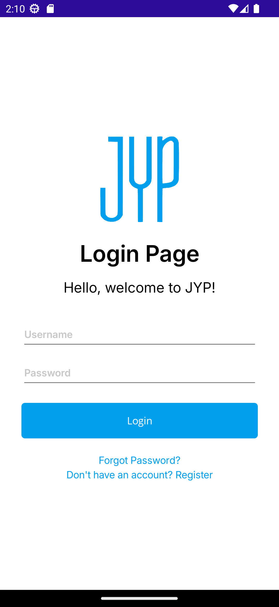

# Module 03 - Exercise 02 (PDC50-LAB)

    Name of Student: Elmalia Jane S. Diaz
    Year and Section: BSIT4A
    Activity Title: Module 03 - Exercise 02
    Date Submitted: September 11, 2024

## Adding Dependency Injection to the Employee View App
### Source Code
- [IMyService.cs](Module03Exercise01/Services/IMyService.cs)
- [MauiProgram.cs](Module03Exercise01/MauiProgram.cs)
- [LoginPage.xaml](Module03Exercise01/View/LoginPage.xaml)
- [LoginPage.xaml.cs](Module03Exercise01/View/LoginPage.xaml.cs)
- [App.xaml.cs](Module03Exercise01/App.xaml.cs)

## Login Page with Service
### Output Screenshot

    

