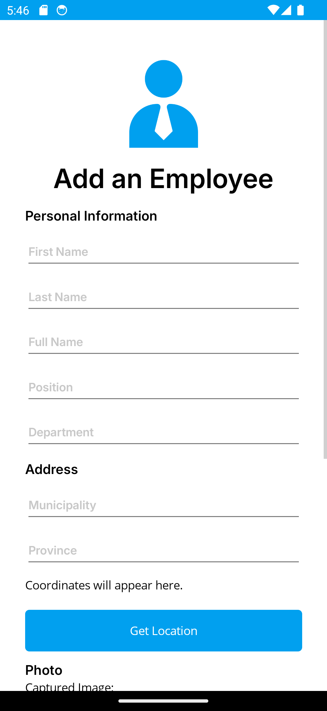
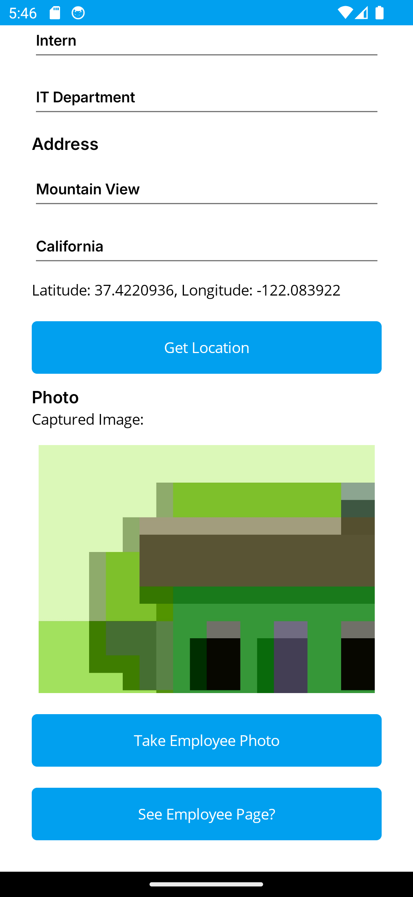

# Module04 - Exercise01 (PDC50-LAB)

    Name of Student: Elmalia Jane S. Diaz
    Year and Section: BSIT4A
    Activity Title: Module04-Exercise01
    Date Submitted: September 25, 2024

## Adding Dependency Injection to the Employee View App
### Source Code
- [AddEmployee.xaml](Module03Exercise01/View/AddEmployee.xaml)
- [AddEmployee.xaml.cs](Module03Exercise01/View/AddEmployee.xaml.cs)

## Add Employee Page
### Output Screenshot

    
    

## Add Employee Page with Details
### Output Screenshot

    
    

